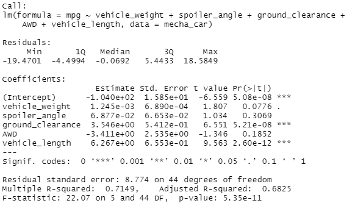
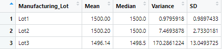
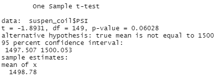
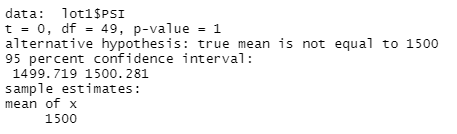
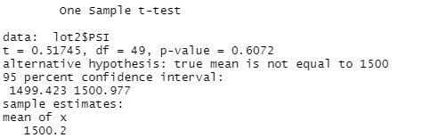
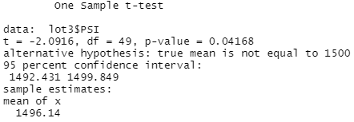

# MechaCar Statistical Analysis

## Linear Regression to Predict MPG

In this excercise we are identifying which variables (lenght, weight, spoiler anglr, ground clearance, AAWD capabiities, MPG, PSI) are related to MechaCar prototype to predict and compare their performance across differentmanufacturer lots.

**Which variables/coefficients provided a non-random amount of variance to the mpg values in the dataset?**

Ground clearance, vehicle length, and thr intercept provided a non-random amount of variance to the mpg values in the datase because their p-values were below 0.05.

**Is the slope of the linear model considered to be zero? Why or why not?**

The slope of the linear model **is not** considered to be zero because the p-value is smaller than the assumed significance level of 0.05.There is significant linear relationship between variables and mpg of MechaCar prototype

**Does this linear model predict mpg of MechaCar prototypes effectively? Why or why not?**

This linear model does predict mpg of MrchaCar prototypes effectively because r-squared of 0.7149 indicates a strong positive linear correlation. 

## Summary Statistics on Suspension Coils

When looking at all lots, the variance suggests that the current manufacturing data meets the 100 pounds per square inch limitation. However, when we look at each lot individually, we can see that the third lot shows a higher variance and exceeds the 100 PSI requirement. 

## T-Tests on Suspension Coils

Since the p-value for the entire lot equals 0.06, we fail to reject the null hypothesis at a significance level of 0.05.
The same applies to lots 1 and 2; however, lot 3 had a p-value of 0.04168 meaning that we can reject the null hypothesis.

## Study Design: MechaCar vs Competition

Write a short description of a statistical study that can quantify how the MechaCar performs against the competition. In your study design, think critically about what metrics would be of interest to a consumer: for a few examples, cost, city or highway fuel efficiency, horse power, maintenance cost, or safety rating.
In your description, address the following questions:

**What metric or metrics are you going to test?**
w

**What is the null hypothesis or alternative hypothesis?**

**What statistical test would you use to test the hypothesis? And why?**

**What data is needed to run the statistical test?**

